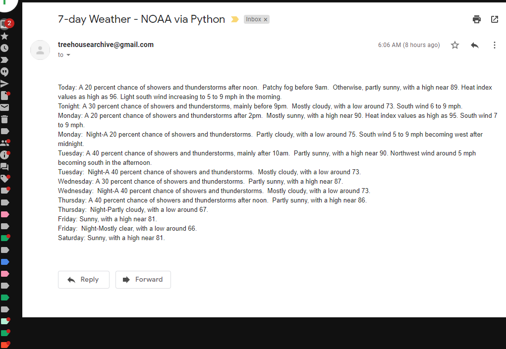

<a id="Top"></a>

# Bob Trieste
## Java, Python, C# - 2019.

- <a href="#AWSsetup">AWS setup environment</a><br>
- <a href="#tos">Scripting in TD Ameritrade's thinkorswim</a><br>
- <a href="#python">Python</a><br>
- <a href="#java">Java</a><br>
- <a href="#FizzBuzzJava">FizzBuzz in Java</a><br>
- <a href="#FizzBuzzPython">FizzBuzz in Python</a><br>
- <a href="#FizzBuzzC#">FizzBuzz in C#</a><br>
- <a href="https://github.com/bobtreehouse/JavaPython2019/blob/master/RobertTriesteCV.pdf">Bob's resume</a><br>


### Sample of Java & Python projects as well as workflow.

 - Java core programming in IntelliJ IDE, JDBC implementation, MySQL, TDD, J-Unit and Mockito testing. 
 - Spring Frameworks, Spring Boot, Eureka microservices, REST APIs, MVC design.
 - Python (NumPy, Pandas, SciPy, matplotlib), Jupyter Notebook & Spyder IDE.
 - Amazon Web Services (AWS) EC2 & Lambda, Twilio API, HTTP, HTML.
 - GitHub, Jenkins, Blue Ocean, Docker and other utilities, services and protocols for software CI/CD. 

    
**Bob Trieste** <br>
917-806-6333 <br>
bobtrieste@gmail.com <br>
www.linkedin.com/in/bobtrieste <br>
https://github.com/bobtreehouse <br>
http://bit.ly/BobTbio <br>


 - This interactive Python notebook contains screenshots and code examples.  <br>
<br>
 - It can be downloaded and run in locally in Jupyter Notebooks or as a PDF. Source code for Python and Java projects <br>
    may also be found in the root directory of this repository or in other public repositories on my GitHub page.<br>
 <br>

<p><a name="AWSsetup"></a></p>

### AWS EC2 Instance for hosting and running apps in the cloud.
 - I employ an Ubuntu-Linux version of Amazon Web Services EC2 remote server to host and run certain code and services.
 - the server is in Amazon's US-Ohio-East region.
 - I connect through a PuTTY SSH client. 


```python
from IPython.core.display import Image, display
PATH = "C:/Users/bobtr/OneDrive/GitProjectFolder/JavaPython2019/ScreenShots/"
display(Image(filename = PATH + "PuTTYsshClient.png", width=452, height=442))

```


**I use software utility cron (UTC time-based job scheduler for Unix operating systems) to schedule repetitive tasks.**


```python
from IPython.core.display import Image, display
PATH = "C:/Users/bobtr/OneDrive/GitProjectFolder/JavaPython2019/ScreenShots/"
display(Image(filename = PATH + "CRONtabAWS.png"))
```


### Java and Python programs sit side by side and can be set to repeat at custom intervals or scheduled to run at a specified time in the future. 

**A python script written in conjunction with use of the Twilio texting API was used to send automated text messages out on regular intervals to members of a sports team for reminders. This code was later ported into Java code and run with a Twilio JAR dependency.** 


```python
from IPython.core.display import Image, display
PATH = "C:/Users/bobtr/OneDrive/GitProjectFolder/JavaPython2019/ScreenShots/"
display(Image(filename = PATH + "CRONeditAWS.png"))
```


## Files can be managed between a local machine and remote server with FileZilla FTP client. 


```python
from IPython.core.display import Image, display
PATH = "C:/Users/bobtr/OneDrive/GitProjectFolder/JavaPython2019/ScreenShots/"
display(Image(filename = PATH + "FileZillaAWS.png"))
```


### Here are some samples of web text-scrapers to read and parse daily morning news and deliver seamlessly to an e-mail inbox. 


```python
#-*- coding: utf-8 -*-
"""
Created on Sun Jan 20 20:22:57 2019

@author: bobtr
"""
import bs4 as bs
import urllib.request 

save_path = ''

sauce = urllib.request.urlopen('https://www.forexlive.com/').read()
soup = bs.BeautifulSoup(sauce, 'lxml')

nav = soup.nav    
body = soup.body

for paragraph in body.find_all("div",{"class":"teaser-text"}):
    print(paragraph.text)

    filename = "forexdailynews.txt"
    f = open(filename, "w") 
    body = soup.body
    text = soup.text
for paragraph in body.find_all("div",{"class":"teaser-text"}): 
   f.write(paragraph.text)
   f.write('\n') 
f.close()
```

    US President Trump remarks to media
    - China wants to make a deal, we'll see what happens
    - China's President Xi has something in mind to do with trade
    - Greenland is strategically interesting
    
    Via the ), the paper say they have the full copy of an unprecedented leak of government documents 
    Sunday Times (gated
    "This is not Project Fear-this is the most realistic assessment of what the public face with no deal. These are likely, basic, reasonable scenarios-not the worst case," a senior government source told the Sunday Times.
    
    Speaking on a TV interview, Navarro said
    More here.
    Dunno where he was with these comments on the day US equities were getting smashed. 
    ForexLive
    
    Trump upbeat on China talks: 
    Whit House economic adviser Larry Kudlow has also been unleashed, doing Sunday television interviews:
    - "No, I don't see a recession" 
    On China talks:
    
    A piece in the Hong Kong press (South China Morning Post) with remarks from a former SAFE (State Administration of Foreign Exchange) official 
     if you'd like more 
    
    German Finance Minister Olaf Scholz spoke on Sunday, 
    - Said Germany has fiscal strength
    - is thus able to counter future economic crisis "with full force"
    --
    
    Good morning, afternoon or evening & welcome to Monday morning. 
    Monday morning market liquidity is very thin. Prices can swing around on not too much at all, so take care out there. Liquidity improves as more Asian centres come on online.
    
    Upbeat comments from the Prez. 
    No details, of course, the market will discount the bluster quickly. 
    ForexLive
    
    What's coming next for global markets
    Bonds are painting an ever-dour message on Fed policy, an end to globilsation and slower
    global growth. We look ahead to next week. 
    If you have a spare hour (I know, who does
    these days?), I have put down the link for my recent webinar on using
    volatility as a framework to manage risk. It breaks down this spreadsheet and
    how you can apply/understand risk reversals, the weekly Commitment of Traders
    report and have a deeper perspective on implied and realised volatility - 
    
    The euro is the linchpin holding everything together, but it's breaking
    The euro closed the week at the lowest level in two years but this might be just the beginning. The ZEW survey this week showed economic expectations tanking and the euro won't be far behind unless Merkel reverses course and starts spending. If the euro goes, it will set off a cascading series of events, as I explain in this video.
    
    Not clear where the tanker is headed
    A Gibraltar court released the Grace 1 tanker on Saturday and the ship is preparing for departure. 
    The move came despite US objections and appeals. The US government issued a warrant to seize the ship, saying all oil aboard the ship is subject to forfeiture due to a "scheme to unlawfully access the US financial system to support illicit shipments" of oil in violations of sanctions.
    
    The central bank rundown
    The weekend is a perfect time for a quick catch up for where the major central banks are at. The central banks will be listed with the most bearish central bank first which will be, drum roll please, and no surprise it's the Bank of England winning the current battle of the bears
    
    Forex news for NY trading on August 16, 2019
    Yes this week, had a day when the Dow and Nasdaq each fell over 3%. However, this week was really about yields. 
    
    Major indices close up 1.2% or better
    The major US indices are closing with provisional gains of 1.2% or better.
    The numbers are showing
    - The S&P index rose  41.12 points or 1.44% at 2888.71
    For the week, despite the solid gains today, the major indices are ending the week with losses (but it could have been worse).
    
    Forex futures positioning data among noncommercial traders for the week ending August 13, 2019
    Highlights:
    ForexLive
    
    Fed Chair Powell speaks at Jackson Hole Economic Policy Symposium on Friday
    The meeting minutes from the last FOMC meeting will be released on Wednesday at 2 PM ET/1800 GMT.   The market is very sensitive to what the Fed might do at their next policy meeting in September. There is a 100% chance for a rate cut, with the market currently pricing in a 32% chance for 50 bps.  
    
    Fed's Mester (non-voter in 2019) speaking. She is generally considered more hawkish.
    Loretta Mester is speaking. She is a nonvoting member of the Fed in 2019 and is generally considered more hawkish:
    
    Up $0.40 or 0.73%
    The high price today extended to $55.67, while the low fell to $54.26.
    The price last Friday close at $54.27. The high for the week reached $57.45 on Tuesday. That was up 5.86% at the highs.  The decline from the high reached $53.77 (a 6.4% decline from the high).  For the week, the gain is 1.1%.  
    
    Speaking to the London Times
    HERE
    There is little reaction in the GBP on the back the comments in the article. 
                    
    
        
        
    ForexLive
    
    Reported earlier today
    Somehow, I missed the release of the weekly NY Fed GDP Nowcast for 3Q growth.
    In the current week, the index rose from 1.58% to 1.82%.  The Atlanta Fed GDPNow forecast also rose this week from 1.9% to 2.2%.
    
    MA will be remembered for the bounces on dips...
    The price of gold is trading down $-9.08 at $1514.21. The low price extended to $1503.77. The high price reached $1528.10 today.
    
    NASDAQ index down only -0.69% on the week.  S&P index -0.94%. Both were down over -3% at the lows for the week
    The Nasdaq has ticked to a new session high and is down only 0.69% on the week.  At the lows, the Nasdaq fell -3.06% from the close last week at 7959.84.  The price just reached a new session high at 7905.35.
    
    According to sources at Buzzfeed
    The UK PM Boris Johnson is to meet France's Macron and Germany's Merkel next week. This according to Buzzfeed.
    
    Minneapolis Fed Pres. Neil Kashkari
    The Minneapolis Pres. Neil Kashkari speaks on CNN:
    Kashkari is not a voting member in 2019
    ForexLive
    
    

## the scraped web content sent via e-mail 


```python
from IPython.core.display import Image, display
PATH = "C:/Users/bobtr/OneDrive/GitProjectFolder/JavaPython2019/ScreenShots/"
display(Image(filename = PATH + "WSJnewsAutoEmail.png"))
```


### Can be customized for other news surces with a sample of the code output below. 


```python
# -*- coding: utf-8 -*-
"""
Created on Mon Jan  7 18:30:25 2019

@author: bobtr
"""
import bs4 as bs
import urllib.request 

save_path = ''
sauce = urllib.request.urlopen('https://www.barrons.com/real-time').read()
sauce2 = urllib.request.urlopen('https://finance.yahoo.com/').read()
soup = bs.BeautifulSoup(sauce, 'lxml')
soup2 = bs.BeautifulSoup(sauce2, 'lxml')
nav = soup.nav  
nav2 = soup2.nav
body = soup.body
body2 = soup2.body
text = soup.text

for paragraph in body.find_all("h3"):
   print(paragraph.text)
   
for paragraph in body2.find_all("h3"):
   print(paragraph.text)
    
   filename = "BarronsDailynews.txt"
   f = open(filename, "w") 
   body = soup.body
   text = soup.text   
for paragraph in body.find_all('h3'):
    f.write(paragraph.text)
    f.write('\n')
       #f.write("")   
for paragraph in body2.find_all('h3'):
    f.write(paragraph.text)
    f.write('\n')
f.close()
```

    Home Depot, L Brands, Analog Devices and More Stocks to Watch
    Retirement Reboot: How to Play Catchup After Being Out of Work
    Yale Built a Large Stake in Slack Stock
    The No. 1 Job in America with the ‘Best Career Opportunities’ Pays $112,000 a Year — and It’s Not in Tech
    South Korea’s Sovereign-Wealth Fund Sold Tesla Stock — and Bought Uber and GM
    What to Watch for in Baidu Earnings
    Merger Arbitrage Fund Managers Share What They’re Seeing
    PG&E Will Get to Steer Its Own Reorganization, Judge Rules
    Tensions Over Huawei Are About to Hit the U.S.-China Trade War Again
    Stanford Now Owns Stakes in Uber and Pinterest Stock
    Harvard University Sold Apple and Facebook Stock — and Bought Alphabet
    Oil and Gas Stocks to Love
    Big IPOs, Like Beyond Meat, Have Had a Good Year. WeWork Wants In.
    In the Lingo of a Trade War, Tariffs Are Just So 80s
    Stocks Swing Wildly as Yield Curve Flips. Is There a Recession Out There?
    When Defensive Stocks Are No Longer the Best Defense
    Myriad Genetics Runs Into Trouble With the F.D.A.
    ViacomCBS: We’ve Seen This Show Before
    A Really Cool Plan: Cut Interest Rates and Buy Greenland
    Letters to Barron’s
    30 business leaders who have backed Trump
    Jackson Hole — What to know in the week ahead
    Soaring U.S. health care costs hit employer plans
    Mark Cuban explains how to make a 16% guaranteed return
    How to Use a P/E Ratio When Picking Stocks
    Kevin O’Leary: This easy math trick helps you crush retirement goals
    These 16 money wasters are why so many Americans can’t save for retirement
    I built a nest egg of $1 million and I’m only 46 — so why do I still spend my waking hours worrying?
    Senior rip-offs are soaring—and you won’t believe who the crooks are
    The No. 1 Job in America with the ‘Best Career Opportunities’ Pays $112,000 a Year — and It’s Not in Tech
    General Electric’s (GE) Biggest Bull Is Unfazed by Harry Markopolos’ Bearish Report
    Hedge Fund Legend Jim Simons Pours Money Into Aurora Cannabis (ACB) and Aphria (APHA) Stocks
    Recession watch: 6 financial moves to make when the economy slows down
    Saudi Oil Fields Are in the Firing Line as Gulf Conflicts Rage
    Here’s the game plan for U.S. stock investors if China retaliates against Trump
    Copy insiders and buy these stocks — because they see no recession looming
    The $4 billion time bomb ticking away inside the biggest marijuana companies
    Briggs & Stratton stock falls to 44-year low after surprise loss, dividend cut and plant closure
    Wall Street Has Abandoned Oil and Gas Stocks. You Shouldn’t.
    This 31-year-old sold $700,000 of stuff online without buying any inventory and the one silver lining for the real-estate market in July
    Door-to-door thieves are using DNA tests to scam you
    These homeowners are putting a floor under house prices
    Here’s what smart rich people really do with their nest egg
    The new math of saving for retirement may boil down to this one, absurdly simple rule
    Baidu Reports Earnings With Stock Holding a Value Level
    San Francisco doesn't care about the stock market
    What really helped Walmart clean up with earnings — robot ‘associates’
    Why gold’s ‘strong undercurrent’ has some analysts eyeing $2,000 an ounce
    


```python
from IPython.core.display import Image, display
PATH = "C:/Users/bobtr/OneDrive/GitProjectFolder/JavaPython2019/ScreenShots/"
display(Image(filename = PATH + "BarronsEndDayNewsAuto.png"))
```


```python
from IPython.core.display import Image, display
PATH = "C:/Users/bobtr/OneDrive/GitProjectFolder/JavaPython2019/ScreenShots/"
<p><a name="java"></a></p>display(Image(filename = PATH + "WeatherEmailAuto.png"))
```





<p><a name="tos"></a></p>

# Some custom watchlist screens built inside thinkorswim (TD Ameritrade) with "thinkscript" (python).


```python
from IPython.core.display import Image, display
PATH = "C:/Users/bobtr/OneDrive/GitProjectFolder/JavaPython2019/ScreenShots/"
display(Image(filename = PATH + "TOSmarketWatchCustomSort.png"))
```


## the above watchlist updated dynamically with live pricing and can be sorted from any column.

### the code behind the scenes (example of a "momentum screen").


```python
from IPython.core.display import Image, display
PATH = "C:/Users/bobtr/OneDrive/GitProjectFolder/JavaPython2019/ScreenShots/"
display(Image(filename = PATH + "TOScustomMomoSignal.png"))
```


## another screen and with a mean-reverting signal...


```python
from IPython.core.display import Image, display
PATH = "C:/Users/bobtr/OneDrive/GitProjectFolder/JavaPython2019/ScreenShots/"
display(Image(filename = PATH + "TOScustomMeanRevertSignal.png"))
```


```python
from IPython.core.display import Image, display
PATH = "C:/Users/bobtr/OneDrive/GitProjectFolder/JavaPython2019/ScreenShots/"
display(Image(filename = PATH + "TOSmarketWatchCustomSort2CustomSort.png"))
```


## thinkorswim (TD Ameritrade) realtime data can be imported into dynamic Excel sheets (similar to Bloomberg DDE server).

### those cells can then have logic applied to build out custom indicies.


```python
from IPython.core.display import Image, display
PATH = "C:/Users/bobtr/OneDrive/GitProjectFolder/JavaPython2019/ScreenShots/"
display(Image(filename = PATH + "TOSdataExcelCustom.png"))
```


```python

```

<p><a name="python"></a></p>

# Some samples of Python logic below

### Python datetime module for generating a world-time clock


```python
import sys
import os
from tkinter import *
import time
import datetime
import pytz
from time import gmtime
from datetime import timedelta
one_hour = timedelta(hours=+1)
tz = pytz.timezone('US/Eastern')
altzone = time.altzone

dt_Japan = datetime.datetime.now(tz=pytz.timezone('Japan'))
dt_UCT = datetime.datetime.now(tz=pytz.timezone('UCT'))
dt_NYC = datetime.datetime.now(tz=pytz.timezone('US/Eastern'))
dt_GMT = datetime.datetime.now(tz=pytz.timezone('GMT'))
dt_UTC = datetime.datetime.now(tz=pytz.timezone('UTC'))
dt_LDN = datetime.datetime.now(tz=pytz.timezone('Europe/London'))
dt_NZ = datetime.datetime.now(tz=pytz.timezone('NZ'))
dt_SYD = datetime.datetime.now(tz=pytz.timezone('Australia/Sydney'))
dt_HK = datetime.datetime.now(tz=pytz.timezone('Hongkong'))
dt_CNH = datetime.datetime.now(tz=pytz.timezone('Asia/Shanghai'))
dt_ZUR = datetime.datetime.now(tz=pytz.timezone('Europe/Zurich'))

print("NYC", dt_NYC.strftime('%a %b %d, %Y: %I:%M:%S:%p '))
print("GMT", dt_GMT.strftime('%a %b %d, %Y: %I:%M:%S:%p '))
print("UTC", dt_UTC.strftime('%a %b %d, %Y: %I:%M:%S:%p '))
print("LDN", dt_LDN.strftime('%a %b %d, %Y: %I:%M:%S:%p '))
print("ZUR", dt_ZUR.strftime('%a %b %d, %Y: %I:%M:%S:%p '))
print("China", dt_CNH.strftime('%a %b %d, %Y: %I:%M:%S:%p '))
print("HK", dt_HK.strftime('%a %b %d, %Y: %I:%M:%S:%p '))
print("Tokyo", dt_Japan.strftime('%a %b %d, %Y: %I:%M:%S:%p '))
print("SYD", dt_SYD.strftime('%a %b %d, %Y: %I:%M:%S:%p '))
print("NZ", dt_NZ.strftime('%a %b %d, %Y: %I:%M:%S:%p '))
```

    NYC Sun Aug 18, 2019: 05:42:13:PM 
    GMT Sun Aug 18, 2019: 09:42:13:PM 
    UTC Sun Aug 18, 2019: 09:42:13:PM 
    LDN Sun Aug 18, 2019: 10:42:13:PM 
    ZUR Sun Aug 18, 2019: 11:42:13:PM 
    China Mon Aug 19, 2019: 05:42:13:AM 
    HK Mon Aug 19, 2019: 05:42:13:AM 
    Tokyo Mon Aug 19, 2019: 06:42:13:AM 
    SYD Mon Aug 19, 2019: 07:42:13:AM 
    NZ Mon Aug 19, 2019: 09:42:13:AM 
    


**Exercise**

**Use a while loop to produce a list of all the prime numbers between 2 and 100. Remember a prime number is only divisibe by itself and one.**


```python
import math
```


```python
primes=[]
N=2
while N<=100:
    is_prime=True
    for num in primes:
        if N%num==0:
            is_prime=False
            break
    if is_prime:
        primes.append(N)
    N=N+1
print(primes)  
```

    [2, 3, 5, 7, 11, 13, 17, 19, 23, 29, 31, 37, 41, 43, 47, 53, 59, 61, 67, 71, 73, 79, 83, 89, 97]
    

**Find the sum of all the multiples of 3 or 5 below 1000.**


```python
x = 3
y = 5
x_list = []
y_list = []

while x < 1000:
    x_list.append(x)
    x += 3

while y < 1000:
    y_list.append(y)
    y += 5

numsum = sum(set(x_list + y_list))
print(numsum)
```

    233168
    

**Let's plot the change in outstanding revolving HELOC loans for the past two years from Fed data.**


```python
import pandas as pd 
```


```python
from matplotlib import pyplot as plt
```


```python
x = [1, 2, 3, 4, 5, 6, 7, 8, 9, 10, 11, 12]
```


```python
y = [254.1, 235.7, 233.4, 231.0, 229.2, 227.5, 225.7, 224.5, 223.3, 226.1, 225.2, 224.8]
```


```python
z = [659.9, 663.8, 663.6, 657.6, 659.2, 661.3, 660.9, 659.2, 658.8, 659.6, 659.8, 660.5]
```


```python
plt.plot(x,y)
plt.title("Revolving HELOC Past 2 years")
plt.xlabel("Date")
plt.ylabel("HELOC Loans 2017 - 2019")
plt.legend(["HELOC", "Time"])
plt.show()
```


```python
Fed_data = pd.read_csv('FedDataLargeBank_2.csv')
```


```python
Fed_data
```


<div>
<style scoped>
    .dataframe tbody tr th:only-of-type {
        vertical-align: middle;
    }

    .dataframe tbody tr th {
        vertical-align: top;
    }

    .dataframe thead th {
        text-align: right;
    }
</style>
<table border="1" class="dataframe">
  <thead>
    <tr style="text-align: right;">
      <th></th>
      <th>Type</th>
      <th>2017</th>
      <th>2018</th>
      <th>2018.1</th>
      <th>2018.2</th>
      <th>2018.3</th>
      <th>2018.4</th>
      <th>2018.5</th>
      <th>2018.6</th>
      <th>2018.7</th>
      <th>2019</th>
      <th>2019.1</th>
      <th>2019.2</th>
    </tr>
  </thead>
  <tbody>
    <tr>
      <th>0</th>
      <td>NaN</td>
      <td>Dec</td>
      <td>Jun</td>
      <td>Jul</td>
      <td>Aug</td>
      <td>Sep</td>
      <td>Oct</td>
      <td>Nov</td>
      <td>Dec</td>
      <td>26-Dec</td>
      <td>2-Jan</td>
      <td>9-Jan</td>
      <td>16-Jan</td>
    </tr>
    <tr>
      <th>1</th>
      <td>Bank credit</td>
      <td>7,327.3</td>
      <td>7,299.9</td>
      <td>7,319.8</td>
      <td>7,331.5</td>
      <td>7,345.2</td>
      <td>7,381.7</td>
      <td>7,437.4</td>
      <td>7,537.7</td>
      <td>7,580.6</td>
      <td>7,602.2</td>
      <td>7,570.7</td>
      <td>7,578.2</td>
    </tr>
    <tr>
      <th>2</th>
      <td>Securities in bank credit 2</td>
      <td>2,256.1</td>
      <td>2,206.3</td>
      <td>2,220.2</td>
      <td>2,231.4</td>
      <td>2,230.7</td>
      <td>2,239.3</td>
      <td>2,269.0</td>
      <td>2,307.1</td>
      <td>2,314.3</td>
      <td>2,332.0</td>
      <td>2,329.2</td>
      <td>2,347.6</td>
    </tr>
    <tr>
      <th>3</th>
      <td>Treasury and agency securities 3</td>
      <td>1,724.8</td>
      <td>1,717.5</td>
      <td>1,728.7</td>
      <td>1,736.9</td>
      <td>1,740.1</td>
      <td>1,752.0</td>
      <td>1,785.4</td>
      <td>1,836.3</td>
      <td>1,845.6</td>
      <td>1,863.1</td>
      <td>1,859.3</td>
      <td>1,878.1</td>
    </tr>
    <tr>
      <th>4</th>
      <td>Mortgage-backed securities (MBS) 4</td>
      <td>1,297.4</td>
      <td>1,294.9</td>
      <td>1,302.3</td>
      <td>1,309.9</td>
      <td>1,309.6</td>
      <td>1,312.8</td>
      <td>1,335.5</td>
      <td>1,360.2</td>
      <td>1,360.1</td>
      <td>1,376.0</td>
      <td>1,368.7</td>
      <td>1,397.0</td>
    </tr>
    <tr>
      <th>5</th>
      <td>Non-MBS 5</td>
      <td>427.4</td>
      <td>422.6</td>
      <td>426.4</td>
      <td>427.0</td>
      <td>430.6</td>
      <td>439.2</td>
      <td>449.9</td>
      <td>476.1</td>
      <td>485.5</td>
      <td>487.1</td>
      <td>490.6</td>
      <td>481.1</td>
    </tr>
    <tr>
      <th>6</th>
      <td>Other securities</td>
      <td>531.3</td>
      <td>488.8</td>
      <td>491.5</td>
      <td>494.5</td>
      <td>490.6</td>
      <td>487.3</td>
      <td>483.6</td>
      <td>470.8</td>
      <td>468.7</td>
      <td>468.9</td>
      <td>469.9</td>
      <td>469.4</td>
    </tr>
    <tr>
      <th>7</th>
      <td>Mortgage-backed securities (MBS) 6</td>
      <td>66.2</td>
      <td>61.8</td>
      <td>60.4</td>
      <td>58.8</td>
      <td>58.4</td>
      <td>57.8</td>
      <td>56.9</td>
      <td>55.2</td>
      <td>54.7</td>
      <td>55.5</td>
      <td>55.5</td>
      <td>55.4</td>
    </tr>
    <tr>
      <th>8</th>
      <td>Non-MBS 7</td>
      <td>465.1</td>
      <td>427.0</td>
      <td>431.1</td>
      <td>435.7</td>
      <td>432.2</td>
      <td>429.5</td>
      <td>426.7</td>
      <td>415.7</td>
      <td>414.0</td>
      <td>413.4</td>
      <td>414.4</td>
      <td>414.0</td>
    </tr>
    <tr>
      <th>9</th>
      <td>Loans and leases in bank credit 8</td>
      <td>5,071.2</td>
      <td>5,093.6</td>
      <td>5,099.7</td>
      <td>5,100.0</td>
      <td>5,114.5</td>
      <td>5,142.3</td>
      <td>5,168.4</td>
      <td>5,230.6</td>
      <td>5,266.2</td>
      <td>5,270.2</td>
      <td>5,241.5</td>
      <td>5,230.7</td>
    </tr>
    <tr>
      <th>10</th>
      <td>Commercial and industrial loans</td>
      <td>1,145.8</td>
      <td>1,185.4</td>
      <td>1,185.2</td>
      <td>1,181.0</td>
      <td>1,185.3</td>
      <td>1,204.4</td>
      <td>1,226.8</td>
      <td>1,248.5</td>
      <td>1,267.7</td>
      <td>1,270.1</td>
      <td>1,257.2</td>
      <td>1,258.8</td>
    </tr>
    <tr>
      <th>11</th>
      <td>Real estate loans</td>
      <td>2,064.9</td>
      <td>2,048.7</td>
      <td>2,051.4</td>
      <td>2,051.4</td>
      <td>2,053.5</td>
      <td>2,055.1</td>
      <td>2,050.6</td>
      <td>2,043.5</td>
      <td>2,036.1</td>
      <td>2,044.9</td>
      <td>2,047.5</td>
      <td>2,044.5</td>
    </tr>
    <tr>
      <th>12</th>
      <td>Residential real estate loans</td>
      <td>1,405.0</td>
      <td>1,385.0</td>
      <td>1,387.8</td>
      <td>1,393.9</td>
      <td>1,394.2</td>
      <td>1,393.8</td>
      <td>1,389.8</td>
      <td>1,384.3</td>
      <td>1,377.3</td>
      <td>1,385.4</td>
      <td>1,387.7</td>
      <td>1,384.0</td>
    </tr>
    <tr>
      <th>13</th>
      <td>Revolving home equity loans</td>
      <td>254.1</td>
      <td>235.7</td>
      <td>233.4</td>
      <td>231.0</td>
      <td>229.2</td>
      <td>227.5</td>
      <td>225.7</td>
      <td>224.5</td>
      <td>223.3</td>
      <td>226.1</td>
      <td>225.2</td>
      <td>224.8</td>
    </tr>
    <tr>
      <th>14</th>
      <td>Closed-end residential loans 9</td>
      <td>1,150.9</td>
      <td>1,149.3</td>
      <td>1,154.4</td>
      <td>1,162.8</td>
      <td>1,165.0</td>
      <td>1,166.3</td>
      <td>1,164.1</td>
      <td>1,159.8</td>
      <td>1,154.0</td>
      <td>1,159.3</td>
      <td>1,162.5</td>
      <td>1,159.2</td>
    </tr>
    <tr>
      <th>15</th>
      <td>Commercial real estate loans</td>
      <td>659.9</td>
      <td>663.8</td>
      <td>663.6</td>
      <td>657.6</td>
      <td>659.2</td>
      <td>661.3</td>
      <td>660.9</td>
      <td>659.2</td>
      <td>658.8</td>
      <td>659.6</td>
      <td>659.8</td>
      <td>660.5</td>
    </tr>
    <tr>
      <th>16</th>
      <td>Construction and land development loans 10</td>
      <td>100.8</td>
      <td>100.9</td>
      <td>100.7</td>
      <td>100.5</td>
      <td>100.6</td>
      <td>99.4</td>
      <td>99.0</td>
      <td>97.7</td>
      <td>96.8</td>
      <td>97.6</td>
      <td>97.1</td>
      <td>96.9</td>
    </tr>
    <tr>
      <th>17</th>
      <td>Secured by farmland 11</td>
      <td>8.6</td>
      <td>8.3</td>
      <td>8.2</td>
      <td>8.3</td>
      <td>8.3</td>
      <td>8.2</td>
      <td>8.1</td>
      <td>8.1</td>
      <td>8.2</td>
      <td>8.2</td>
      <td>8.2</td>
      <td>8.2</td>
    </tr>
    <tr>
      <th>18</th>
      <td>Secured by multifamily properties 12</td>
      <td>139.5</td>
      <td>141.5</td>
      <td>142.3</td>
      <td>142.1</td>
      <td>143.8</td>
      <td>146.6</td>
      <td>146.9</td>
      <td>146.9</td>
      <td>147.3</td>
      <td>144.7</td>
      <td>145.0</td>
      <td>144.8</td>
    </tr>
    <tr>
      <th>19</th>
      <td>Secured by nonfarm nonresidential properties 13</td>
      <td>411.0</td>
      <td>413.0</td>
      <td>412.3</td>
      <td>406.7</td>
      <td>406.5</td>
      <td>407.0</td>
      <td>406.8</td>
      <td>406.4</td>
      <td>406.6</td>
      <td>409.0</td>
      <td>409.5</td>
      <td>410.6</td>
    </tr>
    <tr>
      <th>20</th>
      <td>Consumer loans</td>
      <td>1,098.4</td>
      <td>1,083.2</td>
      <td>1,084.4</td>
      <td>1,090.4</td>
      <td>1,095.1</td>
      <td>1,098.9</td>
      <td>1,108.3</td>
      <td>1,128.0</td>
      <td>1,135.1</td>
      <td>1,135.3</td>
      <td>1,128.0</td>
      <td>1,120.3</td>
    </tr>
    <tr>
      <th>21</th>
      <td>Credit cards and other revolving plans</td>
      <td>656.1</td>
      <td>639.4</td>
      <td>640.1</td>
      <td>644.8</td>
      <td>647.2</td>
      <td>648.6</td>
      <td>657.1</td>
      <td>676.2</td>
      <td>683.4</td>
      <td>680.9</td>
      <td>672.8</td>
      <td>664.8</td>
    </tr>
    <tr>
      <th>22</th>
      <td>Other consumer loans</td>
      <td>442.3</td>
      <td>443.7</td>
      <td>444.4</td>
      <td>445.6</td>
      <td>447.9</td>
      <td>450.3</td>
      <td>451.2</td>
      <td>451.8</td>
      <td>451.7</td>
      <td>454.3</td>
      <td>455.2</td>
      <td>455.4</td>
    </tr>
    <tr>
      <th>23</th>
      <td>Automobile loans 14</td>
      <td>340.3</td>
      <td>339.8</td>
      <td>340.0</td>
      <td>340.6</td>
      <td>341.3</td>
      <td>341.5</td>
      <td>341.3</td>
      <td>341.5</td>
      <td>341.5</td>
      <td>342.2</td>
      <td>343.0</td>
      <td>343.0</td>
    </tr>
    <tr>
      <th>24</th>
      <td>All other consumer loans 15</td>
      <td>102.0</td>
      <td>104.0</td>
      <td>104.3</td>
      <td>105.0</td>
      <td>106.6</td>
      <td>108.7</td>
      <td>109.9</td>
      <td>110.3</td>
      <td>110.2</td>
      <td>112.1</td>
      <td>112.2</td>
      <td>112.4</td>
    </tr>
    <tr>
      <th>25</th>
      <td>All other loans and leases</td>
      <td>762.1</td>
      <td>776.2</td>
      <td>778.6</td>
      <td>777.1</td>
      <td>780.5</td>
      <td>784.0</td>
      <td>782.7</td>
      <td>810.6</td>
      <td>827.3</td>
      <td>819.9</td>
      <td>808.8</td>
      <td>807.1</td>
    </tr>
    <tr>
      <th>26</th>
      <td>Loans to nondepository financial institutions 16</td>
      <td>282.3</td>
      <td>295.6</td>
      <td>302.6</td>
      <td>306.9</td>
      <td>312.3</td>
      <td>319.3</td>
      <td>321.1</td>
      <td>332.3</td>
      <td>336.9</td>
      <td>334.9</td>
      <td>335.8</td>
      <td>334.5</td>
    </tr>
    <tr>
      <th>27</th>
      <td>All loans not elsewhere classified 17</td>
      <td>479.8</td>
      <td>480.7</td>
      <td>476.1</td>
      <td>470.2</td>
      <td>468.3</td>
      <td>464.7</td>
      <td>461.6</td>
      <td>478.4</td>
      <td>490.4</td>
      <td>485.1</td>
      <td>473.1</td>
      <td>472.7</td>
    </tr>
    <tr>
      <th>28</th>
      <td>LESS: Allowance for loan and lease losses</td>
      <td>69.6</td>
      <td>68.4</td>
      <td>68.6</td>
      <td>68.3</td>
      <td>68.4</td>
      <td>67.8</td>
      <td>67.9</td>
      <td>68.0</td>
      <td>67.7</td>
      <td>68.1</td>
      <td>68.6</td>
      <td>68.5</td>
    </tr>
  </tbody>
</table>
</div>


**We can analysze data right from a web URL.**


```python
import pandas as pd
```


```python
movies = pd.read_csv('http://bit.ly/imdbratings')
```


```python
movies.head()
```


<div>
<style scoped>
    .dataframe tbody tr th:only-of-type {
        vertical-align: middle;
    }

    .dataframe tbody tr th {
        vertical-align: top;
    }

    .dataframe thead th {
        text-align: right;
    }
</style>
<table border="1" class="dataframe">
  <thead>
    <tr style="text-align: right;">
      <th></th>
      <th>star_rating</th>
      <th>title</th>
      <th>content_rating</th>
      <th>genre</th>
      <th>duration</th>
      <th>actors_list</th>
    </tr>
  </thead>
  <tbody>
    <tr>
      <th>0</th>
      <td>9.3</td>
      <td>The Shawshank Redemption</td>
      <td>R</td>
      <td>Crime</td>
      <td>142</td>
      <td>[u'Tim Robbins', u'Morgan Freeman', u'Bob Gunt...</td>
    </tr>
    <tr>
      <th>1</th>
      <td>9.2</td>
      <td>The Godfather</td>
      <td>R</td>
      <td>Crime</td>
      <td>175</td>
      <td>[u'Marlon Brando', u'Al Pacino', u'James Caan']</td>
    </tr>
    <tr>
      <th>2</th>
      <td>9.1</td>
      <td>The Godfather: Part II</td>
      <td>R</td>
      <td>Crime</td>
      <td>200</td>
      <td>[u'Al Pacino', u'Robert De Niro', u'Robert Duv...</td>
    </tr>
    <tr>
      <th>3</th>
      <td>9.0</td>
      <td>The Dark Knight</td>
      <td>PG-13</td>
      <td>Action</td>
      <td>152</td>
      <td>[u'Christian Bale', u'Heath Ledger', u'Aaron E...</td>
    </tr>
    <tr>
      <th>4</th>
      <td>8.9</td>
      <td>Pulp Fiction</td>
      <td>R</td>
      <td>Crime</td>
      <td>154</td>
      <td>[u'John Travolta', u'Uma Thurman', u'Samuel L....</td>
    </tr>
  </tbody>
</table>
</div>


```python
movies.shape
```


    (979, 6)


booleans = []
for length in movies.duration:
    if length >= 200:
        booleans.append(True)
    else:
        booleans.append(False)


```python
booleans[0:5]
```


    [False, False, True, False, False]


**Only "The Godfather: Pat II" is 200 minutes or more out of the above sample !**

**Sample code below to clean and parse text and perform word counts**
 - One example of a use case for this would be to compare and contrast FOMC statements for keyowrd differences.


```python
def text_cleaner(in_name,out_name,punc=list('!"#$%&\'()*+,-./:;<=>?@[\\]^_`{|}~')):
    f_in=open(in_name,'r')
    f_out=open(out_name,'w')
    lines=f_in.readlines()
    f_in.close()
    for line in lines:
        line=line.lower()
        for mark in punc:
            line=line.replace(mark,'')
        f_out.write(line)
    f_out.close()
    print(out_name,'has been written')
```

punc=list('!"#$%&\'()*+,-./:;<=>?@[\\]^_`{|}~')


```python
def wordCounter(in_name):
    f_in=open(in_name,'r',encoding="ISO-8859-1")
    lines=f_in.readlines()
    f_in.close()
    
    D={}
    
    for line in lines:
        line=line.strip()
        line=line.lower()
        for mark in '!"#$%&\'()*+,-./:;<=>?@[\\]^_`{|}~':
            line=line.replace(mark,'')
        words=line.split()
        for word in words:
            if word in D:
                D[word]+=1
            else:
                D[word]=1

    
    L=list(D.items())
    return sorted(L,key=lambda x:x[1],reverse=True)
```

**would generate the below once stopwords were removed:**


```python
[('rate', 125),
 ('participants', 105),
 ('federal', 98),
 ('inflation', 89),
 ('economic', 86),
 ('projections', 71),
 ('growth', 70),
 ('market', 67),
 ('percent', 61),
 ('funds', 57),
 ('would', 57),
 ('policy', 55),
 ('board', 47),
 ('risks', 46),
 ('monetary', 43),
 ('outlook', 43),
 ('real', 41),
 ('financial', 40),
 ('conditions', 40),]
```


```python

```

<p><a name="java"></a></p>

# Java

**Java code samples**

**Some logic to handle command line input for numbers that correspond to days of week:**


```python
import java.util.Scanner;
public class DaysWeek {
    public static void main(String[] args) {
        Scanner scan = new Scanner(System.in);
        System.out.println("Enter 1 to 7 digit for days:");
        String userInput = scan.nextLine();
        int userInputDigit = Integer.parseInt(userInput);
        if (userInputDigit == 1) {
            System.out.println("Monday");
        } else if (userInputDigit == 2) {
            System.out.println("Tuesday");
        } else if (userInputDigit == 3) {
            System.out.println("Wednesday");
        } else if (userInputDigit == 4) {
            System.out.println("Thursday");
        } else if (userInputDigit == 5) {
            System.out.println("Friday");
        } else if (userInputDigit == 6) {
            System.out.println("Saturday");
        } else if (userInputDigit == 7) {
            System.out.println("Sunday");
        }
        else {
            System.out.println("Wrong entry");
        }
    }
}
```

**Iterate through List and Arrays**


```python
import java.util.ArrayList;
import java.util.List;


public class Collections2Test {

        public static void main(String[] args) {
            List<String> myList = new ArrayList<String>();

            System.out.println("Size of myList = " + myList.size());

            myList.add("billy");
            myList.add("sal");
            myList.add("sal");
            myList.add("bob");
            myList.add("tommy");


            List<Integer> index = new ArrayList<Integer>();

          for(int i = 0; i<myList.size(); i++){
              if(myList.get(i).equals("sal")) {
                  //index.add(i);
                  System.out.println("index sal at = " +i);
              }

          }
            System.out.println("size before remove " + myList.size());
          myList.remove("sal");
            System.out.println("size after remove " + myList.size());
        }
    }
            /*
            now we can use "clear" and "remove"
            instantiate a list;
            loop through / display  / add parts to list
             */

```

**Finding Min and Max numbers from Arrays**


```python
import java.util.Scanner;

public class MinMaxArray {

    public static void main(String[] args) {
        // get array from user
        // getArrayInput()
        int[] arr = getArrayInput();
        System.out.println("Min number");
        System.out.println("Max number => " + getMaxNumber(arr));
    }

    public static int getMaxNumber(int [] arr){
        int maxNumnber = arr[0];
        for(int element : arr) {
            if(element > maxNumnber) {
                maxNumnber = element;
            }
        }
        return maxNumnber;
    }

    public static int getMinNumber(int [] arr){
        int maxNumnber = arr[0];
        for(int element : arr) {
            if(element > maxNumnber) {
                maxNumnber = element;
            }
        }
        return maxNumnber;
    }


    //[] will return an array in a method
    public static int[] getArrayInput(){
        Scanner myScanner =  new Scanner(System.in);

        System.out.println("Enter number of inputs : ");
        int arraySize = Integer.parseInt(myScanner.nextLine());

        int[] arrayInput = new int[arraySize];

        for(int i = 0; i < arrayInput.length; i++) {
            System.out.println("Enter your number : (" + (i+1) + ")");
            arrayInput[i] = Integer.parseInt(myScanner.nextLine());
        }
        return arrayInput;
    }
}
```

**Implementing Switch Statements**.


```python
import java.util.Scanner;

public class MonthConverterSwitch {

    public static void main(String[] args) {

        Scanner myScanner = new Scanner(System.in);

        System.out.println("Please enter a number between 1 and 12 for the month: ");
        String userInput = myScanner.nextLine();
        int userInputDigit = Integer.parseInt(userInput);

        int switchValue = userInputDigit;

        switch (switchValue) {
            case 1:
                System.out.println("January");
                break;
            case 2:
                System.out.println("February");
                break;
            case 3:
                System.out.println("March");
                break;
            case 4:
                System.out.println("April");
                break;
            case 5:
                System.out.println("May");
                break;
            case 6:
                System.out.println("June");
                break;
            case 7:
                System.out.println("July");
                break;
            case 8:
                System.out.println("August");
                break;
            case 9:
                System.out.println("September");
                break;
            case 10:
                System.out.println("October");
                break;
            case 11:
                System.out.println("November");
                break;
            case 12:
                System.out.println("December");
                break;

            default:
                System.out.println("You have entered an invalid number. You must enter a number between 1 and 12. Goodbye.");
                break;
        }
    }
}
```

## Coding larger projects in IntelliJ IDE with multiple Classes and Interfaces, Service Layer, 
### Controllers, JDBC, testing, etc. (below is screenshot. actual program in source folder).


```python
from IPython.core.display import Image, display
PATH = "C:/Users/bobtr/OneDrive/GitProjectFolder/JavaPython2019/ScreenShots/"
display(Image(filename = PATH + "JavaMavenINtelliJ.png"))
```


```python
from IPython.core.display import Image, display
PATH = "C:/Users/bobtr/OneDrive/GitProjectFolder/JavaPython2019/ScreenShots/"
display(Image(filename = PATH + "IntelliJSample2.png"))
```


```python
from IPython.core.display import Image, display
PATH = "C:/Users/bobtr/OneDrive/GitProjectFolder/JavaPython2019/ScreenShots/"
display(Image(filename = PATH + "POMxmlFile.png"))
```


<p><a name="FizzBuzzJava"></a></p>

### FizzBuzz in Java.
 - ```"FizzBuzz"``` the famous coding interview question to check the logical skills of developers:
 - We will print positive integers from 1 to 100.
 - When a number is a multiple of 3 we will print "Fizz".
 - When a number is a multiple of 5 we will print "Buzz".
 - When a number is a multiple of 3 AND 5 we will print "FizzBuzz".
 - We will make use of "if/else" statements and the "modulo" operation (%) which finds the remainder of the <br />
    Euclidian division of two positive integers.


```python
public class FizzBuzz {

    public static void main(String[] args) {


        for (int i = 1; i <= 100; i++)
            if (i % 3 == 0 && i % 5 == 0) {
                System.out.println("FizzBuzz");
            } else if (i % 3 == 0) {
                System.out.println("Fizz");
            } else if (i % 5 == 0) {
                System.out.println("Buzz");
            } else {
                System.out.println(i);
            }
    }
}
```

<p><a name="FizzBuzzPython"></a></p>

### FizzBuzz in Python.
 - ```"FizzBuzz"``` the famous coding interview question to check the logical skills of developers:
 - We will print positive integers from 1 to 100.
 - When a number is a multiple of 3 we will print "Fizz".
 - When a number is a multiple of 5 we will print "Buzz".
 - When a number is a multiple of 3 AND 5 we will print "FizzBuzz".
 - We will make use of "if/else" statements and the "modulo" operation (%) which finds the remainder of the <br />
    Euclidian division of two positive integers.


```python
for num in range (1,101):
    if num % 3 == 0 and num % 5 == 0:
        print('FizzBuzz')
    elif num % 3 == 0:
        print('Fizz')
    elif num % 5 == 0:
        print('Buzz')
    else:
        print(num)
```

<p><a name="FizzBuzzC#"></a></p>

### FizzBuzz in C#.
 - ```"FizzBuzz"``` the famous coding interview question to check the logical skills of developers:
 - We will print positive integers from 1 to 100.
 - When a number is a multiple of 3 we will print "Fizz".
 - When a number is a multiple of 5 we will print "Buzz".
 - When a number is a multiple of 3 AND 5 we will print "FizzBuzz".
 - We will make use of "if/else" statements and the "modulo" operation (%) which finds the remainder of the <br />
    Euclidian division of two positive integers.


```python
using System;

namespace FizzBuzzCsharp
{
    class Program
    {
        static void Main(string[] args)
        {
            for (int i = 1; i <= 100; i++)
            {
                if (i % 3 == 0 && i % 5 == 0)
                {
                    Console.WriteLine("FizzBuzz");
                }
                else if (i % 3 == 0)
                {
                    Console.WriteLine("Fizz");
                }
                else if (i % 5 == 0)
                {
                    Console.WriteLine("Buzz");
                }
                else
                {
                    Console.WriteLine(i);
                }
            }

        }

    }
}
```

## **In each case above the output will be the same:** 

1                 2                 Fizz
4                 Buzz
Fizz
7                 8                 Fizz
Buzz
11                 Fizz
13                 14                 FizzBuzz
16                 17                 Fizz
19                 Buzz
Fizz
22                 23                 Fizz
Buzz
26                 Fizz
28                 29                 FizzBuzz
31                 32                 Fizz
34                 Buzz
Fizz
37                 38                 Fizz
Buzz
41                 Fizz
43                 44                 FizzBuzz
46                 47                 Fizz
49                 Buzz
Fizz
52                 53                 Fizz
Buzz
56                 Fizz
58                 59                 FizzBuzz
61                 62                 Fizz
64                 Buzz
Fizz
67                 68                 Fizz
Buzz
71                 Fizz
73                 74                 FizzBuzz
76                 77                 Fizz
79                 Buzz
Fizz
82                 83                 Fizz
Buzz
86                 Fizz
88                 89                 FizzBuzz
91                 92                 Fizz
94                 Buzz
Fizz
97                 98                 Fizz
Buzz

### Several full programs are available in the root folder of this repository to inspect further.

### Additionally you can search through other public repositories of mine.

**Bob Trieste** <br>
917-806-6333 <br>
bobtrieste@gmail.com <br>
www.linkedin.com/in/bobtrieste <br>
https://github.com/bobtreehouse <br>
http://bit.ly/BobTbio <br>

<a href="https://github.com/bobtreehouse/JavaPython2019/blob/master/RobertTriesteCV.pdf">Bob's resume</a><br>

[Back to Top](#Top)


